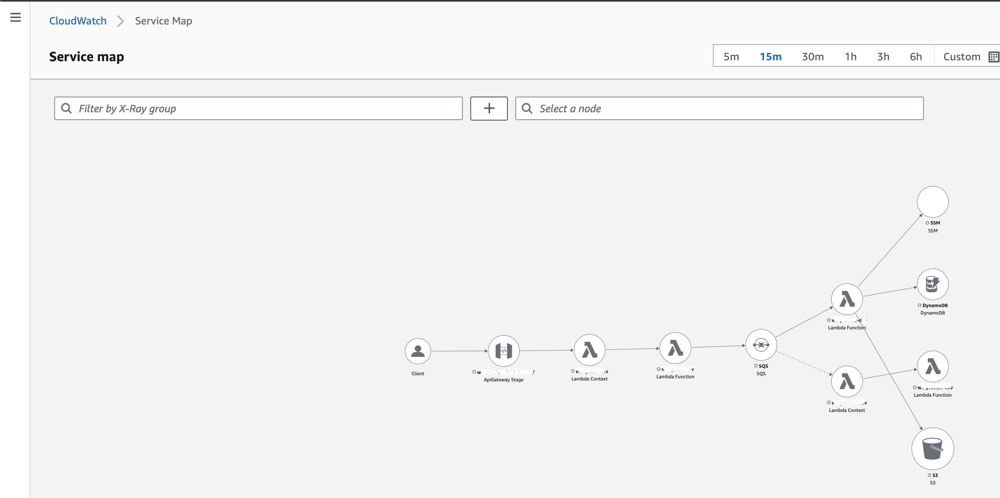
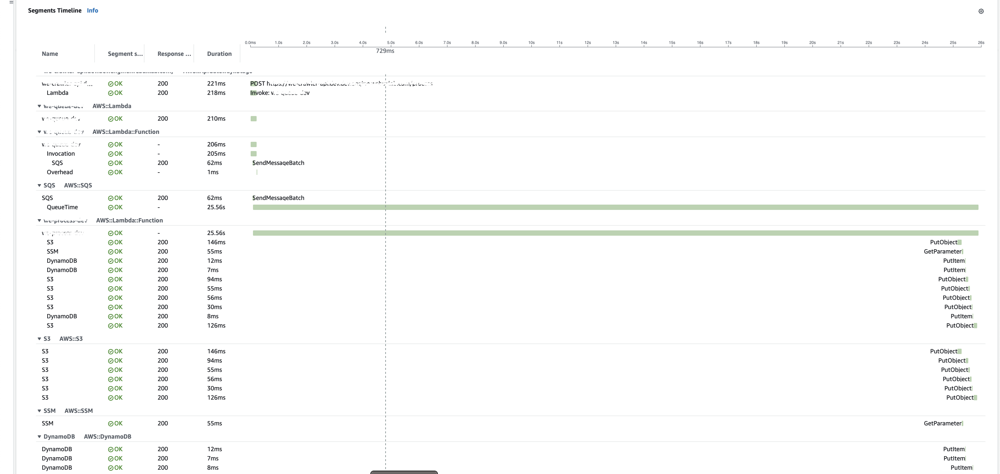

# AWS Utils for NodeJS

Few utils that I use in my different NodeJS Projects.

> As of 2023-03-15, I didn't push those packages to NPM, Usually I use them in my private projects.

---

## Tracing

- [Axios and SSM](./examples/axios.js)
- [DynamoDB](./examples/dynamodb.md)
- [S3](./examples/s3.md)
- [AWS Lambda Handler](./examples/handler.js)

---

## Helpers

- Domain name: Extract the domain name from a string
- Middleware: Fake a cognito authentication for local testing

---

## Screenshots

---

## License

Distributed under the MIT License. See LICENSE for more information.

## Contact

- Tommy Gingras @ tommy@studiowebux.com
